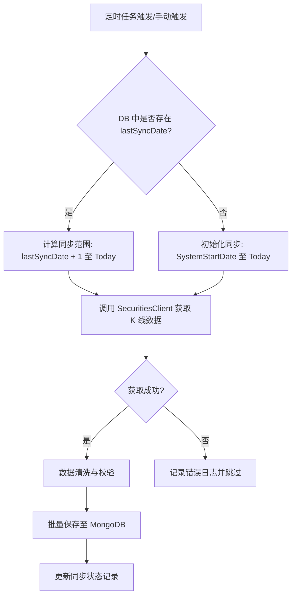

# 01-数据采集模块设计

## 文档信息

| 项目 | 内容 |
|------|------|
| 模块 | 数据采集模块 (Data Collector) |
| Maven ArtifactId | data-collector |
| 包路径 | com.stock.dataCollector |
| 版本 | **3.2.0** |
| 最后更新 | **2026-03-05** |

**重要变更 (v3.1)**:
- ✅ **多模块架构**: 作为独立 Maven 子模块
- ✅ **简化架构**: 标准分层 (client/service/repository/entity/scheduled)
- ✅ **智能增量同步 (Smart Incremental Sync)**: 基于数据库中每支股票的 `lastSyncDate` 自动计算缺失日期范围 `[lastSyncDate + 1, today]`，仅抓取增量数据，支持初始化同步、空洞填补及断点续传。
- ⏳ **新闻采集**: 标记为待实现

## 1. 模块概述

数据采集模块是整个系统的基础数据层，负责从**证券平台**获取股票数据，并存储到 MongoDB 数据库中。

## 2. 系统架构

```
┌─────────────────────────────────────────────────────────┐
│                    证券平台接口                            │
│              (待实现接入)                                 │
│  ┌──────────────────────────────────────────────────┐   │
│  │  公开数据接口 (不需要 Token)                       │   │
│  │  • 股票列表查询                                   │   │
│  │  • 历史 K 线数据                                   │   │
│  │  • 实时行情数据                                   │   │
│  └──────────────────────────────────────────────────┘   │
└───────────────────┬─────────────────────────────────────┘
                    │
                    ▼
┌─────────────────────────────────────────────────────────┐
│                  数据采集层                               │
│  ┌─────────────────────────────────────────────────┐   │
│  │         StockDataService                        │   │
│  │         (股票数据服务)                           │   │
│  │                                                 │   │
│  │  • getHistoryPrices()   - 获取历史 K 线          │   │
│  │  • saveStockPrices()    - 保存价格数据          │   │
│  │  • syncHistoricalData() - 同步历史数据          │   │
│  │  • getAllStocks()       - 获取所有股票          │   │
│  └─────────────────────────────────────────────────┘   │
│                       │                                 │
│  ┌────────────────────┼────────────────────────────┐   │
│  │                    ▼                            │   │
│  │  SecuritiesClient (证券平台客户端)               │   │
│  └─────────────────────────────────────────────────┘   │
│                       │                                 │
│                       ▼                                 │
│              ┌─────────────────┐                        │
│              │   Repository    │                        │
│              │  (数据访问层)   │                        │
│              └────────┬────────┘                        │
└───────────────────────┼─────────────────────────────────┘
                        │
                        ▼
┌─────────────────────────────────────────────────────────┐
│                    数据存储层                             │
│  ┌──────────────┐                                       │
│  │   MongoDB    │                                       │
│  │ (股票价格数据) │                                       │
│  └──────────────┘                                       │
└─────────────────────────────────────────────────────────┘
```

## 3. 核心组件

### 3.1 实际代码结构

```
data-collector/
└── src/main/java/com/stock/dataCollector/
    ├── client/
    │   └── SecuritiesClient.java          # 证券平台 API 客户端
    ├── service/
    │   ├── StockDataService.java          # 股票数据服务
    │   └── StockNewsService.java          # 新闻数据服务 (待实现)
    ├── scheduled/
    │   ├── StockDataSyncScheduler.java    # 股票数据同步定时任务
    │   └── StockNewsScheduler.java        # 新闻采集定时任务 (待实现)
    ├── repository/
    │   ├── PriceRepository.java           # 价格数据访问
    │   ├── StockRepository.java           # 股票信息访问
    │   └── NewsRepository.java            # 新闻数据访问
    ├── entity/
    │   ├── StockPrice.java                # 股票价格实体
    │   ├── StockInfo.java                 # 股票信息实体
    │   └── StockNews.java                 # 股票新闻实体
    └── config/
        └── CommonConfig.java              # 通用配置
```

### 3.2 SecuritiesClient (证券平台客户端)

- **职责**: 调用证券平台 API 获取数据
- **位置**: `client/SecuritiesClient.java`
- **功能**: 
  - `getStockList()`: 获取股票列表
  - `getHistoryKline()`: 获取历史 K 线数据
  - `getRealtimeQuote()`: 获取实时行情

### 3.3 StockDataService (股票数据服务)

- **职责**: 股票数据采集和管理的核心业务逻辑
- **位置**: `service/StockDataService.java`
- **技术**: Spring Boot + MongoDB
- **功能**: 
  - `getHistoryPrices()`: 获取股票历史价格（待接入证券平台）
  - `saveStockPrices()`: 保存价格数据到 MongoDB
  - `syncHistoricalData()`: 同步指定日期范围的历史数据
  - `getAllStocks()`: 获取所有股票信息
  - `getLatestPrice()`: 获取最新价格
- **特点**: 
  - **智能增量同步 (Smart Incremental Sync)**:
    - **最后同步日期 (lastSyncDate)**: 通过 `PriceRepository` 查询每支股票在数据库中存在的最新日期。
    - **混合同步策略 (Hybrid Strategy)**: 
      - **每日增量 (Daily)**: 调用接口默认获取最近数据（约500条），在内存中过滤掉 `date <= lastSyncDate` 的重复数据，仅保存新数据。避免了复杂的日期范围计算和接口限制问题。
      - **每周全量 (Weekly)**: 每周日执行全量同步（从 2005-01-01 开始），自动修复历史数据空洞和遗漏。
    - **容错性**: 每日同步快速轻量，每周同步确保最终一致性。无需复杂的断点续传逻辑，依靠全量同步兜底。
    - **并发同步**: 使用 `CompletableFuture` 实现多支股票并行执行，互不干扰。

### 3.4 Repository 层 (数据访问层)

#### PriceRepository
- **位置**: `repository/PriceRepository.java`
- **职责**: 股票价格数据访问
- **接口**:
  - `findByCodeOrderByDateAsc()`: 按代码查询
  - `findByCodeAndDateBetween()`: 按日期范围查询
  - `deleteByCode()`: 删除指定股票数据
  - `existsByCodeAndDate()`: 检查数据是否存在

#### StockRepository
- **位置**: `repository/StockRepository.java`
- **职责**: 股票基本信息访问
- **接口**:
  - `findByCode()`: 按代码查询
  - `findAllByOrderByCodeAsc()`: 查询所有股票
  - `existsByCode()`: 检查股票是否存在

#### NewsRepository
- **位置**: `repository/NewsRepository.java`
- **职责**: 新闻数据访问
- **状态**: 已定义，待实现完整功能

### 3.5 定时任务

#### StockDataSyncScheduler (股票数据同步)
- **位置**: `scheduled/StockDataSyncScheduler.java`
- **职责**: 定时同步股票数据
- **任务**:
  - **每日同步**: 周一到周五 16:00，同步最新数据
  - **全量同步**: 每周日 2:00，同步所有历史数据
- **特点**: 
  - 并行处理多支股票
  - 异常自动跳过
  - 详细日志记录

#### StockNewsScheduler (新闻采集)
- **位置**: `scheduled/StockNewsScheduler.java`
- **状态**: ⏳ **待实现**
- **计划任务**:
  - 每小时采集一次新闻
  - 每日批量采集所有股票新闻

## 4. 数据流程

### 4.1 股票数据同步流程

```
证券平台接口 (待接入)
    ↓
SecuritiesClient.getHistoryKline()
    ↓
StockDataService.getHistoryPrices()
    ↓
数据转换和验证
    ↓
MongoDB (stock_prices)
    ↓
检测是否已存在
    ↓
新增或更新
```

### 4.2 智能增量同步流程 (Smart Incremental Sync)

```mermaid
graph TD
    A[定时任务触发] --> B{任务类型?}
    B -- 每日增量 (Daily) --> C[获取默认最近数据 (Limit 500)]
    B -- 每周全量 (Weekly) --> D[指定全量范围 (2005-01-01 ~ Yesterday)]
    C --> E[查询 DB lastSyncDate]
    E --> F[内存过滤: Keep if date > lastSyncDate]
    F --> G[批量保存至 MongoDB]
    D --> H[分批/全量获取数据]
    H --> I[批量 Upsert 至 MongoDB]
```

```
每日同步流程 (Daily 18:00)
    ↓
获取所有股票列表
    ↓
并行处理每支股票
    ↓
调用接口获取默认最近数据 (List<StockPrice>)
    ↓
查询 DB 中该股票的 lastSyncDate
    ↓
内存过滤: 只保留 date > lastSyncDate 的记录
    ↓
StockDataService.saveStockPrices() (Upsert)
    ↓
记录日志
```



```
定时任务触发 (StockDataSyncScheduler)
    ↓
获取所有股票列表
    ↓
并行处理每支股票
    ↓
查询 DB 中该股票的最后同步日期 (lastSyncDate)
    ↓
计算同步范围: [lastSyncDate + 1, today]
    ↓
调用 StockDataService.syncHistoricalData(stockCode, startDate, endDate)
    ↓
获取历史价格数据 → 保存到 MongoDB
    ↓
记录日志与同步状态
```

## 5. 接口详细说明

### 5.1 获取历史价格数据

**方法**: `getHistoryPrices(String code)`

**状态**: ⏳ **待实现**

**说明**: 
- 待接入证券平台接口
- 参考代码：`D:\stock-trading\src\main\java\online\mwang\stockTrading\schedule\jobs\RunHistoryJob.java`

**返回数据**:
- 股票代码
- 股票名称
- 交易日期
- 开盘价
- 最高价
- 最低价
- 收盘价
- 成交量
- 成交额

### 5.2 保存并去重数据

**方法**: `saveStockPrices(List<StockPrice> prices)`

**功能**:
- 批量保存价格数据到 MongoDB。
- **唯一性保证**: 通过 `code` + `date` 的复合唯一索引防止重复。
- **冲突处理**: 采用 UPSERT 模式，已存在的数据根据业务规则决定是否覆盖。

**方法**: `saveStockPrices(List<StockPrice> prices)`

**功能**:
- 批量保存价格数据
- 自动检测重复数据
- 增量更新（只更新不完整数据）

**处理逻辑**:
1. 检查是否已存在（code + date）
2. 如果存在且数据完整 → 跳过
3. 如果存在但数据不完整 → 更新
4. 如果不存在 → 插入

### 5.3 同步历史数据

**方法**: `syncHistoricalData(String stockCode, LocalDate startDate, LocalDate endDate)`

**参数**:
- `stockCode`: 股票代码
- `startDate`: 开始日期
- `endDate`: 结束日期

**返回**: 同步的数据条数

**用途**: 
- 定时任务调用
- 手动触发同步
- 数据补全

## 6. 数据存储设计

### 6.1 MongoDB 集合

**stock_prices** (股票价格数据)
```javascript
{
    _id: ObjectId,
    code: String,           // 股票代码
    date: LocalDate,        // 交易日期
    openPrice: BigDecimal,  // 开盘价
    highPrice: BigDecimal,  // 最高价
    lowPrice: BigDecimal,   // 最低价
    closePrice: BigDecimal, // 收盘价
    volume: BigDecimal,     // 成交量（手）
    amount: BigDecimal,     // 成交额（元）
    createTime: LocalDateTime,
    updateTime: LocalDateTime
}
```

**索引**:
```javascript
db.stock_prices.createIndex({code: 1, date: 1}, {unique: true})
db.stock_prices.createIndex({code: 1})
db.stock_prices.createIndex({date: 1})
```

**stock_info** (股票基本信息)
```javascript
{
    id: Long,             // 主键
    code: String,         // 股票代码
    name: String,         // 股票名称
    market: String,       // 市场代码
    price: BigDecimal,    // 当前价格
    changeAmount: BigDecimal, // 涨跌额
    changePercent: BigDecimal, // 涨跌幅
    totalMarketValue: BigDecimal, // 总市值
    turnoverRate: BigDecimal, // 换手率
    volumeRatio: BigDecimal, // 量比
    industryCode: Integer, // 行业代码
    createTime: LocalDateTime, // 创建时间
    updateTime: LocalDateTime  // 更新时间
```

**索引**:
```javascript
db.stock_info.createIndex({code: 1}, {unique: true})
```

## 7. 技术栈

- **框架**: Spring Boot 3.2
- **数据库**: MongoDB 6.0
- **ORM**: Spring Data MongoDB
- **定时任务**: Spring Scheduler
- **工具**: Lombok, Hutool

## 8. Maven 依赖

```xml
<dependencies>
    <!-- Spring Data MongoDB -->
    <dependency>
        <groupId>org.springframework.boot</groupId>
        <artifactId>spring-boot-starter-data-mongodb</artifactId>
    </dependency>
    
    <!-- Lombok -->
    <dependency>
        <groupId>org.projectlombok</groupId>
        <artifactId>lombok</artifactId>
    </dependency>
    
    <!-- Hutool -->
    <dependency>
        <groupId>cn.hutool</groupId>
        <artifactId>hutool-all</artifactId>
    </dependency>
</dependencies>
```

## 9. 关键设计决策

### 9.1 架构简化

- **选择**: 移除复杂的 collector 层和配置类
- **原因**:
  - 减少不必要的抽象
  - 采用标准分层架构
  - 便于理解和维护

### 9.2 数据源统一

- **选择**: 统一使用证券平台接口
- **原因**:
  - 数据更准确可靠
  - 无需维护多个数据源
  - 接口稳定性更好

### 9.3 增量更新

- **设计**: 检测已存在数据，避免重复插入
- **实现**: 
  - 通过 code + date 唯一索引
  - 先查询再决定插入或更新
  - 只更新不完整的数据

### 9.4 并行处理

- **设计**: 定时任务使用并行处理
- **实现**:
  - 使用 CompletableFuture
  - 每支股票独立处理
  - 异常不影响其他股票

## 10. 测试

### 10.1 单元测试

测试文件：`StockDataServiceTest.java` (待创建)

**测试用例**:
- `testGetHistoryPrices()`: 测试获取历史价格
- `testSaveStockPrices()`: 测试保存价格数据
- `testSyncHistoricalData()`: 测试同步历史数据
- `testGetLatestPrice()`: 测试获取最新价格
- `testIncrementalUpdate()`: 测试增量更新

### 10.2 运行测试

```bash
cd backend/data-collector
mvn test
```

## 11. 与其他模块的关系

- **model-service**: 提供历史 K 线数据用于 LSTM 训练和预测
- **strategy-analysis**: 提供股票列表和价格数据用于选股
- **trading-executor**: 不直接交互

## 12. 待实现功能

### 12.1 证券平台接口接入

**位置**: `client/SecuritiesClient`, `service/StockDataService.getHistoryPrices()`

**参考代码**:
`D:\stock-trading\src\main\java\online\mwang\stockTrading\schedule\jobs\RunHistoryJob.java`

**工作内容**:
1. 实现 HTTP 客户端调用证券平台接口
2. 解析返回的 JSON 数据
3. 转换为 StockPrice 实体
4. 处理异常情况

### 12.2 新闻采集功能

**状态**: ⏳ **待实现**

**位置**: `service/StockNewsService`, `scheduled/StockNewsScheduler`

**工作内容**:
1. 实现新闻采集接口
2. 解析新闻内容
3. 识别相关股票代码
4. 保存到 MongoDB

## 13. 常见问题

### Q1: 如何接入证券平台接口？
A: 参考 `RunHistoryJob.java` 的实现，在 `SecuritiesClient` 中调用证券平台接口。

### Q2: 数据如何保证不重复？
A: MongoDB 有 code + date 的唯一索引，插入前会先查询是否已存在。

### Q3: 定时任务如何配置？
A: 在 `application.yml` 中配置 cron 表达式，默认每日 16:00 和每周日 2:00。

### Q4: 新闻采集何时实现？
A: 目前标记为 TODO，优先级较低，待股票数据功能完善后实现。

### Q5: 如何单独构建此模块？
A: 执行 `cd backend/data-collector && mvn clean package`