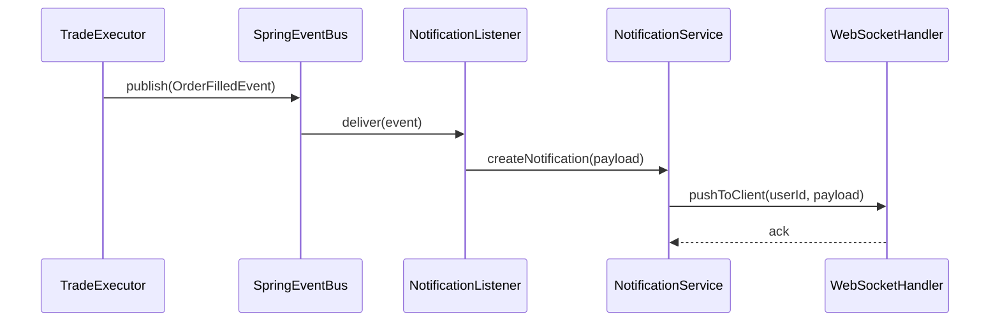

# 04-交易执行模块设计

## 文档信息

| 项目 | 内容 |
|------|------|
| 模块 | 交易执行模块 (Trading Executor) |
| Maven ArtifactId | trading-executor |
| 包路径 | com.stock.tradingExecutor |
| 版本 | **4.0.0** |
| 最后更新 | **2026-03-08** |

**重要变更 (v4.0)**:
- ✅ **新增动态任务调度**: JobConfig 实体持久化、JobSchedulerService + ThreadPoolTaskScheduler、JobAdminController 管理 API、JobBootstrap 启动加载
- ✅ **新增 WebSocket 推送**: WebSocketConfig 注册 `/ws/notifications` 与 `/ws/logs`，NotificationWebSocketHandler、LogWebSocketHandler 广播
- ✅ **新增订单通知**: OrderNotificationEvent、NotificationListener（@Async）、NotificationService 格式化后经 WebSocket 推送

**重要变更 (v3.0)**:
- ✅ **新增价格监控器**: PriceMonitor 组件，监控价格决定执行时机
- ✅ **新增订单轮询器**: OrderPoller 组件，跟踪订单执行状态
- ✅ **新增券商适配器**: BrokerAdapter 接口，抽象券商API差异
- ✅ **新增交易时间检查器**: TradingTimeChecker 组件
- ✅ **新增手续费计算器**: FeeCalculator 组件
- ✅ **完善数据流程**: 增加价格监控、订单轮询、失败重试等环节

## 1. 模块概述

执行模块是系统的交易执行层，负责风控检查、价格监控、订单执行和持仓管理，确保交易安全可控。同时作为主启动模块，聚合所有其他模块。

## 2. 系统架构

```
┌─────────────────────────────────────────────────────────────────────┐
│                          输入数据                                    │
│  ┌──────────────┐    ┌──────────────┐    ┌──────────────┐          │
│  │  交易信号     │    │  当前持仓     │    │  账户资金     │          │
│  │ (策略模块)    │    │  (数据库)     │    │ (券商API)    │          │
│  └──────┬───────┘    └──────┬───────┘    └──────┬───────┘          │
└─────────┼──────────────────┼──────────────────┼────────────────────┘
          │                  │                  │
          ▼                  ▼                  ▼
┌─────────────────────────────────────────────────────────────────────┐
│                       风控检查层                                      │
│  ┌─────────────────────────────────────────────────────────────┐   │
│  │              RiskController (风控检查器)                      │   │
│  │  ┌─────────┐ ┌─────────┐ ┌─────────┐ ┌─────────┐ ┌─────────┐│   │
│  │  │止损检查 │ │仓位检查 │ │熔断检查 │ │T+1检查  │ │涨跌停   ││   │
│  │  └─────────┘ └─────────┘ └─────────┘ └─────────┘ └─────────┘│   │
│  └─────────────────────────────┬───────────────────────────────┘   │
└─────────────────────────────────┼───────────────────────────────────┘
                                  │
                    ┌─────────────┴─────────────┐
                    │ 通过？                     │
                    └─────────────┬─────────────┘
                                  │
                   是             │             否
                   │              │              │
                   ▼              │              ▼
┌─────────────────────────────────────────────────────────────────────┐
│                       价格监控层                                      │
│  ┌─────────────────────────────────────────────────────────────┐   │
│  │              PriceMonitor (价格监控器)                        │   │
│  │  ┌─────────────┐  ┌─────────────┐  ┌─────────────┐          │   │
│  │  │ 价格采样     │  │ 均价计算     │  │ 触发判断     │          │   │
│  │  └─────────────┘  └─────────────┘  └─────────────┘          │   │
│  └─────────────────────────────┬───────────────────────────────┘   │
└─────────────────────────────────┼───────────────────────────────────┘
                                  │
                    ┌─────────────┴─────────────┐
                    │ 执行条件满足？              │
                    └─────────────┬─────────────┘
                                  │
                   是             │             否 → 继续监控
                   │              │
                   ▼              │
┌─────────────────────────────────────────────────────────────────────┐
│                       交易执行层                                      │
│  ┌─────────────────────────────────────────────────────────────┐   │
│  │              TradeExecutor (交易执行器)                       │   │
│  │                                                              │   │
│  │  ┌─────────────┐  ┌─────────────┐  ┌─────────────┐          │   │
│  │  │ 买入执行     │  │ 卖出执行     │  │ 订单确认     │          │   │
│  │  └─────────────┘  └─────────────┘  └─────────────┘          │   │
│  └─────────────────────────────┬───────────────────────────────┘   │
└─────────────────────────────────┼───────────────────────────────────┘
                                  │
                                  ▼
┌─────────────────────────────────────────────────────────────────────┐
│                       订单跟踪层                                      │
│  ┌─────────────────────────────────────────────────────────────┐   │
│  │              OrderPoller (订单轮询器)                         │   │
│  │  ┌─────────────┐  ┌─────────────┐  ┌─────────────┐          │   │
│  │  │ 状态轮询     │  │ 超时撤单     │  │ 失败重试     │          │   │
│  │  └─────────────┘  └─────────────┘  └─────────────┘          │   │
│  └─────────────────────────────┬───────────────────────────────┘   │
└─────────────────────────────────┼───────────────────────────────────┘
                                  │
                                  ▼
┌─────────────────────────────────────────────────────────────────────┐
│                       券商适配层                                      │
│  ┌─────────────────────────────────────────────────────────────┐   │
│  │              BrokerAdapter (券商适配器)                       │   │
│  │  ┌─────────────┐  ┌─────────────┐  ┌─────────────┐          │   │
│  │  │ 账户查询     │  │ 行情获取     │  │ 委托管理     │          │   │
│  │  └─────────────┘  └─────────────┘  └─────────────┘          │   │
│  └─────────────────────────────────────────────────────────────┘   │
└─────────────────────────────────────────────────────────────────────┘
```

## 3. 核心组件

### 3.1 代码结构

```
trading-executor/
└── src/main/java/com/stock/tradingExecutor/
    ├── TradingExecutorApplication.java       # 主启动类
    ├── risk/
    │   ├── RiskController.java               # 风控检查器
    │   └── RiskConfig.java                    # 风控参数配置
    ├── execution/
    │   ├── TradeExecutor.java                # 交易执行器
    │   ├── PriceMonitor.java                 # 价格监控器
    │   └── OrderPoller.java                   # 订单轮询器
    ├── broker/
    │   ├── BrokerAdapter.java                # 券商适配接口
    │   └── ZXBrokerAdapter.java               # 中信证券实现
    ├── job/
    │   ├── JobConfig.java                    # 任务配置实体
    │   ├── JobConfigRepository.java          # 任务配置数据访问
    │   ├── JobSchedulerService.java          # 动态调度服务
    │   ├── JobAdminController.java           # 任务管理 API
    │   └── JobBootstrap.java                 # 启动时初始化并加载任务
    ├── handler/
    │   ├── NotificationWebSocketHandler.java # 业务通知 /ws/notifications
    │   └── LogWebSocketHandler.java          # 日志推送 /ws/logs
    ├── event/
    │   ├── OrderNotificationEvent.java       # 订单通知事件
    │   └── NotificationListener.java         # 监听并转 WebSocket 推送
    ├── service/
    │   └── NotificationService.java          # 通知格式化与广播
    ├── time/
    │   └── TradingTimeChecker.java           # 交易时间检查器
    ├── fee/
    │   └── FeeCalculator.java                # 手续费计算器
    ├── enums/
    │   └── OrderStatus.java                  # 订单状态枚举
    └── config/
        ├── WebSocketConfig.java              # WebSocket 端点注册
        └── WebConfig.java                    # Web 配置
```

### 3.2 StockTradingApplication (主启动类)

- **位置**: `StockTradingApplication.java`
- **职责**: Spring Boot 应用入口
- **功能**:
  - 启动 Spring Boot 应用
  - 聚合所有模块依赖
  - 提供 main 方法入口

### 3.3 RiskController (风控检查器)

- **位置**: `risk/RiskController.java`
- **职责**: 交易前的风险评估
- **检查项**:
  - 止损检查：是否触发止损线
  - 仓位检查：是否超过仓位限制
  - 熔断检查：是否触发熔断机制
  - T+1检查：当日买入是否可卖出
  - 涨跌停检查：涨停不买、跌停不卖
- **输出**: RiskCheckResult(通过/拒绝，违规列表)

**数据结构**:
```java
// 风控检查结果
@Data
@Builder
public class RiskCheckResult {
    private boolean passed;
    private List<String> violations;      // 违规列表
    private AccountStatus accountStatus;  // 账户状态
}

// 持仓信息
@Data
public class Position {
    private String stockCode;
    private String stockName;
    private Integer quantity;
    private BigDecimal avgCost;
    private BigDecimal currentPrice;
    private BigDecimal profitLoss;
    private BigDecimal profitLossPercent;
    private LocalDate buyDate;           // 买入日期(T+1检查)
}

// 账户状态
@Data
public class AccountStatus {
    private BigDecimal totalAssets;      // 总资产
    private BigDecimal availableCash;    // 可用资金
    private BigDecimal frozenAmount;     // 冻结资金
    private BigDecimal totalPosition;    // 总持仓市值
    private Double dailyProfitLossPercent;  // 当日盈亏比例
    private Double monthlyProfitLossPercent; // 当月盈亏比例
    private Double totalPositionPercent;    // 总仓位比例
}
```

### 3.4 TradeExecutor (交易执行器)

- **位置**: `execution/TradeExecutor.java`
- **职责**: 执行买入/卖出交易
- **功能**:
  - 生成交易订单
  - 执行交易 (模拟/实盘)
  - 确认交易结果
  - 更新持仓和账户
  - 计算并记录手续费
- **模式**: 支持模拟交易和实盘交易切换

**数据结构**:
```java
// 订单结果
@Data
@Builder
public class OrderResult {
    private boolean success;
    private String orderId;              // 委托编号
    private String stockCode;
    private String direction;            // BUY/SELL
    private BigDecimal price;
    private Integer quantity;
    private BigDecimal amount;           // 成交金额
    private BigDecimal fee;              // 手续费
    private OrderStatus status;
    private String message;
    private LocalDateTime submitTime;
    private LocalDateTime fillTime;
}
```

### 3.5 PriceMonitor (价格监控器)

- **位置**: `execution/PriceMonitor.java`
- **职责**: 监控股票价格，决定最佳执行时机
- **功能**:
  - 定时采样股票价格
  - 计算滚动均价
  - 判断是否满足执行条件
  - 尾盘强制执行判断

**配置参数**:
```java
@Data
public class MonitorConfig {
    private Long sampleIntervalSeconds = 20L;    // 采样间隔
    private Integer minSampleCount = 5;           // 最少采样次数
    private Double buyThresholdPercent = -0.01;  // 买入阈值(均价-1%)
    private Double sellThresholdPercent = 0.005; // 卖出阈值(均价+0.5%)
    private LocalTime forceExecuteTime = LocalTime.of(14, 55); // 强制执行时间
}
```

**数据结构**:
```java
@Data
public class PriceSample {
    private String stockCode;
    private BigDecimal price;
    private LocalDateTime sampleTime;
}

@Data
public class MonitorState {
    private String stockCode;
    private String direction;
    private List<PriceSample> samples;
    private BigDecimal avgPrice;
    private BigDecimal thresholdPrice;
    private LocalDateTime startTime;
}
```

### 3.6 OrderPoller (订单轮询器)

- **位置**: `execution/OrderPoller.java`
- **职责**: 跟踪订单执行状态
- **功能**:
  - 定时轮询订单状态
  - 超时自动撤单
  - 失败重试管理
  - 状态变更通知

**配置参数**:
```java
@Data
public class PollerConfig {
    private Long pollIntervalSeconds = 10L;  // 轮询间隔
    private Integer maxPollCount = 18;       // 最大轮询次数
    private Long timeoutSeconds = 60L;       // 超时时间
    private Integer maxRetryCount = 10;      // 最大重试次数
}
```

**数据结构**:
```java
@Data
public class PollState {
    private String orderId;
    private int pollCount;
    private int retryCount;
    private OrderStatus lastStatus;
    private LocalDateTime startTime;
    private LocalDateTime lastPollTime;
}
```

### 3.7 BrokerAdapter (券商适配器接口)

- **位置**: `broker/BrokerAdapter.java`
- **职责**: 抽象券商API差异，统一接口
- **方法**:
  - `getAccountInfo()`: 获取账户资金信息
  - `getRealtimePrice(stockCode)`: 获取股票实时价格
  - `submitOrder(direction, stockCode, price, quantity)`: 提交委托
  - `queryOrderStatus(orderId)`: 查询委托状态
  - `cancelOrder(orderId)`: 撤销委托

**实现类**:
- `ZXBrokerAdapter`: 中信证券实现
- `MockBrokerAdapter`: 模拟交易实现

### 3.8 TradingTimeChecker (交易时间检查器)

- **位置**: `time/TradingTimeChecker.java`
- **职责**: 检查交易时间和时段
- **方法**:
  - `isTradingTime()`: 是否在交易时段
  - `isNearClose()`: 是否临近收盘(14:55后)
  - `getBuyDeadLine()`: 买入截止时间
  - `getSellDeadLine()`: 卖出截止时间

**交易时间配置**:
```
早盘: 09:30 - 11:30
午盘: 13:00 - 15:00
买入截止: 14:50
卖出截止: 14:55
```

### 3.9 FeeCalculator (手续费计算器)

- **位置**: `fee/FeeCalculator.java`
- **职责**: 计算交易手续费
- **规则**: 万分之五，最低5元
- **方法**: `calculate(amount)`: 计算手续费

**配置参数**:
```java
@Data
public class FeeConfig {
    private Double feeRate = 0.0005;     // 万分之五
    private Double minFee = 5.0;         // 最低5元
}
```

### 3.10 OrderStatus (订单状态枚举)

- **位置**: `enums/OrderStatus.java`
- **职责**: 定义订单状态
- **枚举值**:
  - `PENDING`: 待执行
  - `SUBMITTED`: 已报
  - `PARTIAL`: 部分成交
  - `FILLED`: 已成交
  - `CANCELLED`: 已撤销
  - `REJECTED`: 废单
  - `TIMEOUT`: 超时

### 3.11 WebConfig (Web 配置)

- **位置**: `config/WebConfig.java`
- **职责**: Web 层配置
- **功能**:
  - 静态资源服务 (前端文件)
  - CORS 跨域配置
  - 路径映射

### 3.12 动态任务调度 (Job)

- **位置**: `job/` 包
- **职责**: 将原 @Scheduled 定时任务改为数据库配置驱动，支持 Cron 可变、启用/禁用、手动触发、执行状态回写。

**JobConfig 实体** (`job/JobConfig.java`):
- `jobName` 唯一、`cronExpression`、`status`(0 禁用/1 启用)、`beanName`、`methodName`、`params`
- `lastRunTime`、`lastCostTime`、`lastStatus`、`errorMessage` 记录最近一次执行

**JobSchedulerService** (`job/JobSchedulerService.java`):
- 使用 `ThreadPoolTaskScheduler` + `CronTrigger` 调度，`Map<String, ScheduledFuture<?>>` 维护运行中任务
- `startAllActiveJobs()`: 加载所有 status=1 的任务并注册
- `startJob(JobConfig)` / `stopJob(jobName)`: 单任务启停
- `runJobNow(jobId)`: 手动触发一次（新线程执行）
- `updateJobCron(jobId, newCron)`: 更新 Cron 并重新调度
- `toggleJobStatus(jobId, active)`: 启用/禁用并同步调度状态
- 执行时通过反射调用 `applicationContext.getBean(beanName).methodName()`，执行后更新 `lastRunTime/lastStatus/errorMessage`

**JobAdminController** (`job/JobAdminController.java`):
- `GET /api/jobs`: 列表所有任务
- `POST /api/jobs/{id}/run`: 手动执行
- `POST /api/jobs/{id}/status`: body `{ "active": true|false }` 启用/禁用
- `POST /api/jobs/{id}/cron`: body `{ "cron": "0 0 18 * * MON-FRI" }` 更新 Cron

**JobBootstrap** (`job/JobBootstrap.java`):
- `ApplicationRunner`，启动后异步执行 `initJobsAsync()`
- 若库中不存在则插入默认定时任务（如 stockListSync、dailyStockDataSync、stockSelection、signalGeneration、intradayRiskControl、forceSellCheck 等），再调用 `JobSchedulerService.startAllActiveJobs()`

### 3.13 WebSocket 实时推送

- **位置**: `config/WebSocketConfig.java`、`handler/NotificationWebSocketHandler.java`、`handler/LogWebSocketHandler.java`
- **职责**: 提供两个 WebSocket 端点，供前端实时接收通知与日志。

**WebSocketConfig**:
- `@EnableWebSocket`，注册：
  - `LogWebSocketHandler` → `/ws/logs`
  - `NotificationWebSocketHandler` → `/ws/notifications`
- `setAllowedOrigins("*")`（可按需收紧）

**NotificationWebSocketHandler**:
- 继承 `TextWebSocketHandler`，使用 `ConcurrentHashMap` 维护 `Set<WebSocketSession>`
- `afterConnectionEstablished` 加入集合，`afterConnectionClosed` 移除
- `broadcast(String message)`: 向所有已连接 session 发送 `TextMessage`，单路异常不影响其他连接

**LogWebSocketHandler**:
- 同样维护 session 集合，提供静态 `broadcast(String message)`，供 logback 等日志组件调用，将日志流推送到前端。

### 3.14 订单通知（事件驱动 + WebSocket）

- **位置**: `event/OrderNotificationEvent.java`、`event/NotificationListener.java`、`service/NotificationService.java`
- **职责**: 订单执行结果通过 Spring 事件异步转 WebSocket 推送，不阻塞交易主流程。

**OrderNotificationEvent**:
- `ApplicationEvent`，携带 `OrderResult result`、`String type`（如 "BUY"/"SELL"）
- 由 `TradeExecutor` 在买入/卖出执行后发布：`eventPublisher.publishEvent(new OrderNotificationEvent(this, result, "BUY"))`

**NotificationListener**:
- `@EventListener` + `@Async` 监听 `OrderNotificationEvent`
- 调用 `NotificationService.notifyOrder(event.getResult(), event.getType())`

**NotificationService**:
- 注入 `NotificationWebSocketHandler`
- `notifyOrder(OrderResult result, String type)`: 将 result 转为 `NotificationMessage`（id、type、level、title、content、timestamp、data），按订单状态设 level(success/error/info) 和 title（如「买入成交」「卖出已取消」），JSON 序列化后 `notificationHandler.broadcast(json)`
- `notifyError(title, errorMsg)`: 推送错误类通知

### 4. 系统通知设计

#### 目标

描述交易执行模块向前端和其它系统组件下发事件的统一方案，设计目标是低耦合、易扩展、可观测和可重试的通知链路。

#### 架构概览

总体流程采用 Spring 事件总线作为模块间的异步解耦点，典型调用链如下：

TradeExecutor -> Spring Event -> NotificationListener -> NotificationService -> WebSocketHandler

具体职责：
- TradeExecutor: 在关键点（提交订单、订单状态变更、成交、失败、撤单等）发布领域事件（如 OrderSubmittedEvent、OrderFilledEvent、OrderFailedEvent）。
- Spring Event: 作为轻量级事件总线，负责将事件投递给注册的监听器（同步或异步执行）。
- NotificationListener: 订阅领域事件，负责将领域事件转换为通知请求（NotificationPayload），并传递给 NotificationService。可以在此处做简单的过滤、聚合或去抖动处理。建议使用 @Async 或 ApplicationEventPublisher 结合执行器异步处理以避免阻塞执行线程。
- NotificationService: 负责通知的路由、格式化、持久化（可选）以及重试策略。实现可支持多种通道（WebSocket、邮件、短信、企业微信等），并隐藏具体通道实现细节。
- WebSocketHandler: 管理 WebSocket 会话，将最终通知推送到前端客户端。也可提供按用户/会话分发、消息序列号、确认回执等能力。

#### 类与包建议

- com.stock.tradingExecutor.notification.event
  - OrderSubmittedEvent.java
  - OrderFilledEvent.java
  - OrderFailedEvent.java
- com.stock.tradingExecutor.notification.listener
  - NotificationListener.java
- com.stock.tradingExecutor.notification.service
  - NotificationService.java
  - NotificationRepository.java (可选，用于持久化通知历史)
- com.stock.tradingExecutor.web.websocket
  - WebSocketHandler.java

#### 时序图 (Mermaid)



#### 解耦与好处

结论 → 证据 → 推理 → 验证步骤 → 规避方案

结论: 使用 Spring 事件总线和集中式 NotificationService 将交易执行与通知传递完全解耦，提升系统可维护性和可扩展性。

证据: TradeExecutor 负责业务核心（生成和确认订单），但不直接处理通知发送逻辑；通知链路由独立组件处理并通过事件订阅触发。

推理: 将通知逻辑从执行器中剥离后，可以独立扩展通知通道（增加邮件/短信/企业微信），单独做性能调优或持久化策略，避免通知失败影响交易执行主流程。异步事件处理还能降低延迟峰值对交易线程池的压力，并提高容错性（支持重试和死信队列）。

验证步骤:
- 在 TradeExecutor 的关键路径发布事件，并在 NotificationListener 中记录收到的事件日志。
- 通过集成测试模拟 OrderFilledEvent，断言 NotificationService 收到并调用 WebSocketHandler。
- 在高并发场景下，评估 TradeExecutor 响应时间是否未因通知逻辑而显著增加。

规避方案:
- 如果需要强一致（同步确认通知送达后再继续流程），可以在特定场景下使用同步事件或在 NotificationService 提供确认阻塞接口，但需慎用以免影响交易吞吐。
- 对重要通知（如资金异常、风控拒单）建议同时持久化到 NotificationRepository，并配合重试/报警机制。

----

## 4. 风控规则

### 4.1 止损规则

| 规则名 | 阈值 | 说明 |
|--------|------|------|
| 日亏损限制 | 3% | 当日累计亏损超过 3% 禁止买入 |
| 月亏损限制 | 10% | 当月累计亏损超过 10% 禁止买入 |
| 个股止损 | 8% | 单只股票亏损超过 8% 触发卖出 |
| 总止损 | 15% | 总账户亏损超过 15% 清仓 |

### 4.2 仓位规则

| 规则名 | 阈值 | 说明 |
|--------|------|------|
| 单股仓位上限 | 30% | 单只股票市值不超过总资产 30% |
| 总仓位上限 | 80% | 股票总市值不超过总资产 80% |
| 最低仓位 | 20% | 保持至少 20% 现金应对风险 |
| 行业集中度 | 50% | 同一行业股票不超过 50% |

### 4.3 交易限制

| 规则名 | 限制 | 说明 |
|--------|------|------|
| 单笔最小金额 | 1000 元 | 低于此金额不执行 |
| 单日交易次数 | 10 次 | 超过次数禁止交易 |
| T+1 规则 | 强制 | 当日买入次日才能卖出 |
| 涨跌停限制 | 强制 | 涨停不买入，跌停不卖出 |

## 5. 数据流程

### 5.1 买入交易流程

```
交易信号 (买入)
    ↓
风控检查 (止损/仓位/熔断/涨跌停)
    ↓
通过？──否──→ 拒绝并记录原因
    │
    是
    ↓
价格监控 (采样→计算均价→等待触发)
    │
    ├─→ 价格 <= 均价*(1-阈值%) → 执行
    │
    └─→ 尾盘强制 (14:55后) → 执行
    ↓
计算买入金额/数量
    ↓
提交买入订单
    ↓
订单状态轮询 (每10秒，最多18次)
    │
    ├─→ 已成 → 成功
    │
    ├─→ 60秒未成交 → 自动撤单
    │
    └─→ 失败 → 重试 (<10次)
    ↓
更新持仓 (增加)
    ↓
更新账户 (扣减资金+手续费)
    ↓
记录交易流水
    ↓
输出：交易结果
```

### 5.2 卖出交易流程

```
卖出信号 或 止损触发
    ↓
风控检查 (T+1/跌停)
    ↓
通过？──否──→ 拒绝并记录原因
    │
    是
    ↓
价格监控 (采样→计算均价→等待触发)
    │
    ├─→ 价格 >= 均价*(1+阈值%) → 执行
    │
    └─→ 尾盘强制 (14:57后) → 执行
    ↓
提交卖出订单
    ↓
订单状态轮询 (每10秒，最多18次)
    │
    ├─→ 已成 → 成功
    │
    ├─→ 60秒未成交 → 自动撤单
    │
    └─→ 失败 → 重试 (<10次)
    ↓
更新持仓 (减少/清空)
    ↓
更新账户 (增加资金-手续费)
    ↓
计算盈亏
    ↓
记录交易流水
    ↓
输出：交易结果
```

### 5.3 风控检查流程

```
交易请求
    ↓
止损检查 (日亏损>3% 或 月亏损>10%) → 失败 → 拒绝
    ↓ 通过
仓位检查 (单股>30% 或 总仓位>80%) → 失败 → 拒绝
    ↓ 通过
熔断检查 (市场异常) → 失败 → 拒绝
    ↓ 通过
T+1 检查 (当日买入) → 失败 → 拒绝
    ↓ 通过
涨跌停检查 (涨停买/跌停卖) → 失败 → 拒绝
    ↓ 通过
通过
```

### 5.4 订单轮询流程

```
订单提交成功
    ↓
开始轮询 (每10秒)
    ↓
查询订单状态
    │
    ├─→ 已成 → 返回成功
    │
    ├─→ 废单 → 返回失败
    │
    ├─→ 已报 → 继续轮询
    │           └─→ 超过60秒 → 自动撤单
    │
    └─→ 已撤 → 返回失败
    ↓
达到最大轮询次数 (18次)
    ↓
返回超时
```

## 6. 技术栈

- **框架**: Spring Boot 3.2.2
- **ORM**: Spring Data JPA (自动建表)
- **数据库**: MySQL 8.0
- **缓存**: Redis 7.x
- **并发**: Java ThreadPoolExecutor

## 7. Maven 依赖

```xml
<dependencies>
    <!-- Internal Modules -->
    <dependency>
        <groupId>com.stock</groupId>
        <artifactId>strategy-analysis</artifactId>
    </dependency>
    <dependency>
        <groupId>com.stock</groupId>
        <artifactId>model-service</artifactId>
    </dependency>
    <dependency>
        <groupId>com.stock</groupId>
        <artifactId>data-collector</artifactId>
    </dependency>
    
    <!-- Spring Boot Starter Web -->
    <dependency>
        <groupId>org.springframework.boot</groupId>
        <artifactId>spring-boot-starter-web</artifactId>
    </dependency>
    
    <!-- Spring Data JPA -->
    <dependency>
        <groupId>org.springframework.boot</groupId>
        <artifactId>spring-boot-starter-data-jpa</artifactId>
    </dependency>
    
    <!-- Redis -->
    <dependency>
        <groupId>org.springframework.boot</groupId>
        <artifactId>spring-boot-starter-data-redis</artifactId>
    </dependency>
</dependencies>
```

## 8. 关键设计决策

### 8.1 主模块设计

- **选择**: trading-executor 作为主启动模块
- **原因**:
  - 聚合所有业务模块依赖
  - 包含应用入口类
  - 便于统一部署

### 8.2 风控优先

- 所有交易必须通过风控检查
- 风控规则可配置，但强制执行
- 风控失败详细记录原因

### 8.3 模拟/实盘隔离

- 支持模拟交易模式
- 模拟和实盘数据完全隔离
- 便于策略验证和测试

### 8.4 事务保证

- 交易执行使用事务
- 持仓和账户同时更新
- 失败回滚保证数据一致性

### 8.5 券商适配设计

- 抽象券商API差异为统一接口
- 支持多种券商实现切换
- 模拟交易与实盘交易隔离

## 9. 对外接口

### 9.1 REST API

```java
// 风控检查接口
GET /api/risk/check?stockCode=xxx
Response: RiskCheckResult

// 交易执行接口
POST /api/trade/buy
Request: { String stockCode; int quantity; double price; }
Response: OrderResult

POST /api/trade/sell
Request: { String stockCode; int quantity; double price; }
Response: OrderResult

// 持仓查询接口
GET /api/positions
Response: List<Position>

// 账户查询接口
GET /api/account
Response: AccountStatus

// 动态任务调度接口
GET  /api/jobs                 // 列表所有任务配置
POST /api/jobs/{id}/run        // 手动触发执行
POST /api/jobs/{id}/status     // 启用/禁用 body: { "active": true|false }
POST /api/jobs/{id}/cron       // 更新 Cron body: { "cron": "0 0 18 * * MON-FRI" }
```

### 9.2 WebSocket 端点

- `/ws/notifications`: 业务通知（订单成交/拒绝/取消等），消息为 JSON，含 type、level、title、content、timestamp、data
- `/ws/logs`: 实时日志推送，文本消息

### 9.3 券商适配接口（BrokerAdapter）

```java
public interface BrokerAdapter {
    // 获取账户资金信息
    AccountInfo getAccountInfo();
    
    // 获取股票实时价格
    Double getRealtimePrice(String stockCode);
    
    // 提交委托订单
    OrderResult submitOrder(String direction, String stockCode, Double price, Integer quantity);
    
    // 查询委托状态
    OrderStatus queryOrderStatus(String orderId);
    
    // 撤销委托
    Boolean cancelOrder(String orderId);
}
```

### 9.4 价格监控接口

```java
public interface PriceMonitor {
    // 开始价格监控
    void startMonitor(String stockCode, String direction, MonitorConfig config);
    
    // 计算均价
    BigDecimal calculateAvgPrice();
    
    // 判断是否执行
    Boolean shouldExecute();
    
    // 是否临近收盘
    Boolean isNearClose();
    
    // 停止监控
    void stopMonitor();
}
```

## 10. 与其他模块的关系

- **strategy-analysis**: 获取交易信号
- **data-collector**: 获取实时价格用于风控检查
- **model-service**: 获取预测结果用于决策参考
- **frontend**: 提供持仓、账户、订单查询接口

## 11. 组件交互关系

```
┌─────────────────────────────────────────────────────────────────┐
│                        TradeExecutor                             │
│                           │                                      │
│           ┌───────────────┼───────────────┐                      │
│           ▼               ▼               ▼                      │
│   RiskController    PriceMonitor    OrderPoller                 │
│           │               │               │                      │
│           │               │               │                      │
│           └───────────────┼───────────────┘                      │
│                           ▼                                      │
│                    BrokerAdapter                                 │
│                    ┌─────┴─────┐                                 │
│                    ▼           ▼                                 │
│              ZXBroker    MockBroker                              │
└─────────────────────────────────────────────────────────────────┘
```

## 12. 待优化项

1. 支持更多券商接口 (华泰、招商等)
2. 添加交易滑点估计
3. 实现智能订单路由
4. 添加交易成本分析
5. 支持算法交易 (TWAP/VWAP)
6. 增加订单管理器 (OrderManager)
7. 增加持仓管理器 (PositionManager)
8. 增加账户管理器 (AccountManager)
9. 增加交易日志审计功能
10. 增加风控参数动态配置功能
