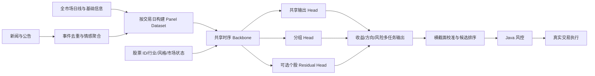

<!-- AI_GENERATE_START -------- -->
# 全市场共享股票预测模型详细设计
> **训练归属更新说明（2026-10-09）**：本文的共享 LSTM、Embedding、Group Head、Residual Head 和多任务输出设计继续有效；训练实现和模型发布职责已迁移到 `python/` 目标架构，Java 端最终只保留在线特征、ONNX 推理、策略和风控。实施顺序以《三端目录简化与 Python 模型迁移执行计划》为准。

## 1. 文档信息

| 项目 | 内容 |
|---|---|
| 文档日期 | 2026-10-08 |
| 适用系统 | stock-trading4 自动真实交易系统 |
| 设计范围 | LSTM 价格预测、情感特征融合、模型训练与推理 |
| 当前阶段 | 设计评审，尚未实施模型代码改造 |
| 推荐结论 | 全市场共享基础模型 + 股票/行业特征 + 少量分组模型 + 可选轻量个股输出层 |

## 2. 背景与目标

系统目标是面向 A 股全市场进行自动选股和自动真实交易。模型的职责不是直接下单，而是输出可比较、可追溯的候选信号；Java 策略、风控和交易执行链负责资金、持仓、T+1、涨跌停、交易时间、幂等和券商委托。

本设计解决以下核心问题：

1. 单只股票历史样本有限，逐股训练 LSTM 容易过拟合。
2. 全市场股票分布差异较大，简单混合训练会丢失股票、行业和风格差异。
3. 当前预测目标偏向下一日价格，跨股票不可直接比较，不适合全市场排序。
4. 当前训练与推理的归一化口径不完全一致，且时间切分存在潜在信息泄漏。
5. 情感模型已有真实推理能力，但新闻聚合仍缺少时间衰减、来源质量和事件去重。
6. 系统需要自动运行，但不应建设复杂模型审批、在线训练平台和大量独立模型运维能力。

设计目标：

- 最大化利用全市场历史数据，提升泛化能力和冷启动能力。
- 保留行业、风格和个股差异，避免所有股票被同一输出规则粗暴处理。
- 输出适用于横截面选股的收益、方向和风险信号。
- 训练仅在收盘后离线执行，交易时段只读取当前生效模型进行推理。
- 模型失效时停止生成对应候选，不使用随机值、模拟值或规则值冒充模型结果。
- 只维护当前生效版本和必要历史元数据，不建设复杂生命周期平台。

## 3. 当前实现现状

### 3.1 LSTM 现状

当前代码按股票代码训练和保存独立模型，收盘后任务逐只遍历股票，单只股票默认读取约 500 个交易日数据。输入窗口为 60 日，特征维度为 11，主要包括 OHLCV、RSI、MACD、SMA、布林带和 OBV。

当前标签是下一交易日收盘价经过单股最大价格归一化后的数值。该目标适合还原价格，但不适合直接比较不同股票的上涨机会，也没有直接描述相对指数表现。

当前数据处理先在完整数据上计算最大值和技术指标归一化参数，再按 80%/20% 切分训练集和验证集。相邻滑动窗口高度重叠，验证区间可能间接使用训练区间之外的统计信息。

推理阶段根据最新价格窗口重新计算归一化参数，而模型文档中的 `normalizationParams` 没有形成严格的训练推理同源契约。市场分布变化时，同一模型可能接收到与训练阶段不同口径的输入。

当前 LSTM 将所有时间步输出展平后连接全连接层，参数量随窗口长度增长。单股样本不足时，容易记忆训练区间而不是学习可迁移的时序规律。

### 3.2 情感分析现状

交易候选链路读取最近 36 小时、每只股票最多 20 条真实新闻或公告，调用真实情感模型，按置信度进行加权平均。严格交易入口使用 `analyzeSentimentRequired`，模型不可用或推理失败时停止候选生成。

现有聚合仍缺少：

- 新闻发布时间衰减。
- 来源可信度权重。
- 同一事件多媒体转载去重。
- 公告、监管处罚、业绩预告等事件类型权重。
- 强负面事件否决或风险标志。
- 新闻覆盖不足时的置信度折扣。

### 3.3 综合评分现状

`ScoreCalculator` 将 LSTM 因子与情感因子按策略配置权重线性合成，默认配置约为 50%/50%。现有结构简单，但两个分数的统计分布、可靠度和时间有效期不同，直接固定权重容易造成某一类信号在特定市场阶段被高估。

## 4. 三种模型方案定义

### 4.1 方案 A：全市场单一共享模型

所有股票共用一套 LSTM 参数，全部样本进入同一个面板数据集。最简版本只输入行情和技术指标，不提供股票、行业或风格标识。

该方案的关键区别是“一个模型”而不是“一个正确的共享模型”。如果缺少股票和行业身份特征，模型只能学习平均市场规律，容易混淆不同波动率、流动性和行业周期。

### 4.2 方案 B：每只股票独立小模型

每只股票拥有独立的训练样本、模型参数、归一化参数和模型版本。当前实现总体接近该方案。

模型可以针对个股拟合，但训练样本通常只有数百到数千条，而可训练参数较多，容易产生高方差和不稳定预测。全市场数千个模型还会放大训练、存储、加载、排障和版本一致性成本。

### 4.3 方案 C：共享基础模型 + 分组模型 + 可选个股输出层

全市场样本训练共享时序主干，输入显式加入股票、行业、风格和市场状态特征。主干上连接少量分组输出层；只有样本量、流动性和样本外稳定性满足条件的股票，才启用轻量个股输出层。

最终输出由共享输出、分组输出和可选个股输出按固定结构组合。个股层只是小规模校正，不复制整套 LSTM。

## 5. 方案对比

| 评价维度 | 方案 A：单一共享模型 | 方案 B：逐股独立小模型 | 方案 C：共享主干 + 分组/个股层 |
|---|---|---|---|
| 数据利用率 | 高 | 低 | 高 |
| 单股冷启动 | 好 | 差 | 好 |
| 个股差异表达 | 低，除非增加身份特征 | 高 | 中高 |
| 行业差异表达 | 低，除非增加行业特征 | 隐式但样本不足 | 高 |
| 过拟合风险 | 中 | 高 | 中低 |
| 全市场泛化 | 高 | 低 | 高 |
| 训练耗时 | 最低 | 最高 | 中等 |
| 推理效率 | 最高 | 低 | 高 |
| 模型数量 | 1 | 数千 | 1 个主干 + 少量分组头 + 少量个股头 |
| 运维复杂度 | 低 | 高 | 中等 |
| 版本一致性 | 最容易 | 最困难 | 可控 |
| 异常定位 | 简单 | 困难 | 中等 |
| 个股制度变化适应 | 较弱 | 较强但易过拟合 | 较强 |
| 当前代码迁移成本 | 中 | 最低 | 中高 |
| 长期维护成本 | 低 | 最高 | 中等 |
| 全市场自动选股适配度 | 7/10 | 4/10 | 9/10 |

### 5.1 方案 A 优势

- 样本规模最大，可学习跨股票共性的趋势、反转、量价和市场状态规律。
- 只有一个模型版本，训练、加载、回滚和推理都最简单。
- 新股或历史较短股票可直接使用共享模型，冷启动能力好。
- 易于构建全市场统一排序分数。

### 5.2 方案 A 劣势

- 若没有股票 ID、行业、风格和市场状态特征，不同股票的数据分布会相互干扰。
- 单一输出层容易偏向样本多、流动性高或波动特征占主导的股票群体。
- 对特殊行业、周期股、金融股和小盘股的结构差异表达不足。
- 模型一旦整体失效，影响整个候选池。

### 5.3 方案 B 优势

- 个股特征表达直接，每只股票可使用独立归一化和超参数。
- 单只股票异常不会直接影响其他股票。
- 与当前逐股训练、逐股模型存储方式最接近，短期改动较小。

### 5.4 方案 B 劣势

- 500 个交易日扣除 60 日窗口后，可用样本只有约 440 条，远不足以稳定训练多层 LSTM。
- 模型容易拟合某段行情，样本外性能波动大。
- 停牌、上市时间短、数据缺失股票无法稳定训练。
- 数千模型需要逐一训练、保存、加载和更新，收盘后训练窗口难以保证。
- 无法充分利用行业内和全市场的共同规律。
- 参数、归一化、版本和故障状态容易分裂，长期维护成本最高。

### 5.5 方案 C 优势

- 主干使用全市场数据，解决单股样本不足和冷启动问题。
- 股票、行业和风格 embedding 显式表达横截面差异。
- 分组输出层可以学习成长、周期、金融、大盘、小盘等不同收益结构。
- 个股输出层参数很少，只做残差校正，过拟合风险远低于完整个股 LSTM。
- 主干和输出层可以采用不同更新频率，兼顾稳定性与个性化。
- 模型数量可控，适合收盘后离线训练和交易时段稳定推理。

### 5.6 方案 C 劣势

- 数据集、特征字典、模型路由和版本契约比单模型复杂。
- 行业和风格分组需要稳定定义，频繁调整会破坏历史一致性。
- 个股输出层启停需要明确准入标准，否则仍会退化成数千个模型。
- DJL 中实现多输入、多输出和 embedding 的工程成本高于当前顺序模型。

## 6. 当前业务适配结论

当前业务是“全市场候选排序 + 每日收盘后离线训练 + 自动真实交易 + 无人工逐单确认”。这个场景更重视横截面排序稳定性、训练可完成性、可追溯性和失败阻断，而不是追求每只股票拥有独立复杂模型。

因此：

1. 不采用长期逐股完整 LSTM。它与全市场规模和有限历史样本不匹配。
2. 不采用无身份特征的朴素共享模型。它无法充分表达行业和个股差异。
3. 推荐方案 C，并分阶段实施：先完成带身份和行业特征的共享模型，再增加少量分组头，最后只为少数稳定股票增加轻量个股头。

## 7. 推荐总体架构

### 7.1 模型边界

- 模型只输出预测和置信度，不持有券商凭据。
- 模型不得绕过 `RiskController` 或直接调用 `ZXBrokerAdapter`。
- 训练只在收盘后任务中执行，生产交易时段禁止训练和临时切换。
- 模型发布使用原子切换，单次推理必须绑定唯一版本。
- 推理结果必须保存数据截止日期、模型版本、特征版本和情感聚合版本。

## 8. 数据集设计

### 8.1 面板数据主键

每条样本使用以下逻辑主键：

`(tradeDate, stockCode, featureVersion, labelVersion)`

同一交易日包含当日可交易股票横截面。训练样本只使用在该交易日收盘时已经可获得的数据，禁止使用未来复权因子、未来行业分类和事后修订数据。

### 8.2 股票池过滤

训练前应过滤：

- 上市不足最小历史窗口的股票。
- 长期停牌或窗口内有效交易日不足的股票。
- 价格、成交量或复权数据异常的股票。
- 明确不可交易状态的股票。

ST、退市整理、涨跌停和低流动性股票不应简单删除。建议保留状态特征，让模型学习其风险，同时在真实交易风控中独立限制。

### 8.3 时间切分

禁止随机切分。推荐：

- 训练集：较早连续交易日。
- 验证集：训练集之后的连续交易日。
- 测试集：验证集之后的连续交易日。
- 训练与验证、验证与测试之间设置 purge gap，至少覆盖最大标签预测周期。
- 使用 walk-forward 滚动验证，评价多个市场阶段，而不是只看单一时间段。

示例：训练 3 年、验证 3 个月、测试 3 个月，每 1 个月向前滚动一次。具体窗口由数据覆盖度决定，不在代码中散落硬编码。

### 8.4 防泄漏规则

- 标准化参数只允许用当前训练窗口计算。
- 行业分类使用当时有效值，不使用最新分类回填历史。
- 情感新闻以实际发布时间为准，盘后发布不得进入当日盘中决策。
- 技术指标只能由当前及以前数据计算。
- 标签计算可使用未来收益，但标签字段绝不能进入特征。
- 股票池纳入条件必须按当时状态计算，避免幸存者偏差。

## 9. 特征设计

### 9.1 行情时序特征

价格类特征统一使用相对量，避免不同股价尺度污染共享模型：

- 开盘、最高、最低、收盘相对前收收益率。
- 1、3、5、10、20、60 日收益率。
- 真实波幅、振幅、跳空幅度。
- 成交量和成交额的对数变化、滚动标准分。
- 换手率、量比和流动性指标。
- RSI、MACD、均线偏离率、布林带位置、OBV 变化率。
- 历史波动率、下行波动率和最大回撤。

绝对价格只用于结果还原和交易展示，不作为共享模型主要输入。

### 9.2 股票身份特征

- `stockIdEmbedding`：表达长期稳定的个股差异。
- 上市年限。
- 流通市值分位数。
- 历史流动性分位数。
- 长期波动率分位数。

股票 ID embedding 必须设置未知股票入口。新股先使用共享模型和行业特征，历史足够后再分配稳定 embedding。

### 9.3 行业与风格特征

- 一级行业和二级行业 embedding。
- 大盘、中盘、小盘风格。
- 价值、成长、周期、防御等风格标签。
- 国企、民企等稳定属性，仅在数据可靠时使用。

行业分类变更必须版本化。分组头数量保持少量，初期建议 4 到 8 组，不按每个行业建立完整模型。

### 9.4 市场状态特征

- 沪深主要指数近 1、5、20 日收益。
- 全市场上涨比例、涨停/跌停数量。
- 市场成交额及其分位数。
- 指数波动率和市场宽度。
- 风格轮动状态。

市场状态能帮助同一股票信号在牛市、震荡和风险释放阶段产生不同解释。

### 9.5 情感事件特征

情感不建议只在最终评分阶段线性相加。推荐同时保留两条路径：

1. 作为模型输入：最近 6、12、24、36 小时聚合分数、强负面标志、新闻数量和覆盖置信度。
2. 作为策略确认：对强负面事件执行候选降权或否决，但仍由确定性 Java 规则执行。

聚合公式建议：

`eventWeight = confidence × timeDecay × sourceWeight × eventTypeWeight / duplicateCount`

其中时间衰减可使用指数衰减；同一事件转载聚类后只保留一份主事件权重，避免媒体数量被误认为信息强度。

## 10. 标签与多任务输出

### 10.1 主标签

主回归标签使用下一交易日相对基准的超额收益：

`excessReturn(t+1) = stockReturn(t+1) - benchmarkReturn(t+1)`

比预测绝对收盘价更适合全市场横截面排序，也能减少整体市场涨跌对模型的干扰。

### 10.2 辅助标签

- 方向分类：下一交易日超额收益是否大于阈值。
- 风险回归：未来 1 到 3 日最大不利变动。
- 可交易性分类：次日是否存在停牌、一字板或极端流动性风险。

### 10.3 输出定义

推荐输出：

| 输出 | 类型 | 用途 |
|---|---|---|
| expectedExcessReturn | 回归 | 横截面排序主信号 |
| upProbability | 分类概率 | 方向确认和概率校准 |
| downsideRisk | 非负回归 | 风险调整后的排名 |
| modelConfidence | 校准分数 | 控制低置信度候选 |

最终模型分数建议为固定可解释公式：

`modelScore = calibratedReturnScore × directionConfidence - riskPenalty`

情感确认和交易风控继续在模型外保留，不让模型承担全部交易规则。

## 11. 模型结构设计

### 11.1 共享时序主干

输入形状：`[batch, sequenceLength, marketFeatureCount]`。

建议初始结构：

- 1 到 2 层 LSTM，隐藏维度 64 到 128。
- 只使用最后时间步或注意力池化结果，不展平全部时间步。
- LayerNorm + Dropout。
- 与静态特征 embedding 拼接后进入共享全连接层。

第一阶段继续使用 LSTM，避免同时更换数据结构和算法。Transformer、TCN 或 LightGBM 只作为后续对照基线，不直接替换生产模型。

### 11.2 分组输出层

按稳定风格或行业组路由到少量输出层。分组输出层只包含一到两层小型全连接网络，参数量远小于共享主干。

初期可采用：

- 大盘稳定组。
- 中小盘成长组。
- 周期资源组。
- 金融地产组。
- 防御消费组。
- 其他组。

分组由配置版本管理，不能由在线页面动态任意修改。

### 11.3 个股轻量输出层

个股层只预测相对共享和分组输出的残差：

`finalOutput = sharedOutput + groupResidual + stockResidual`

启用条件建议同时满足：

- 至少有 3 年以上有效历史数据。
- 最近一年流动性达到最低标准。
- walk-forward 样本外指标连续多个窗口优于无个股层基线。
- 增益超过交易成本和复杂度阈值。

个股层不满足条件时必须自动回退到“共享 + 分组”，而不是阻断整个股票的预测。

## 12. 训练方案

### 12.1 阶段一：共享基础模型训练

1. 按交易日构建全市场 panel dataset。
2. 只用训练窗口拟合标准化器和类别字典。
3. 对股票样本按交易日和流动性做平衡采样，避免少数大盘股主导。
4. 训练共享主干和共享输出层。
5. 在多个 walk-forward 窗口计算横截面指标和交易指标。
6. 固化模型、标准化器、特征字典和版本元数据。

损失函数建议为多任务加权：

`totalLoss = w1 × HuberLoss(excessReturn) + w2 × BCE(upProbability) + w3 × HuberLoss(downsideRisk)`

权重先固定少量经过验证的值，不建设通用参数优化器。

### 12.2 阶段二：分组输出层训练

- 先冻结共享主干，训练各分组输出层。
- 每组样本不足时合并到“其他组”。
- 分组层只有在样本外指标显著改善时启用。
- 启用后再以较低学习率联合微调主干和分组层。

### 12.3 阶段三：个股输出层微调

- 只对满足准入条件的股票创建个股层。
- 共享主干默认冻结，个股层使用较低学习率和强正则化。
- 个股层连续多个窗口无增益时停用并删除当前路由，不删除历史评估记录。
- 禁止为全市场无条件创建个股层。

### 12.4 日常离线更新

建议更新节奏：

- 每个交易日收盘后：同步数据、生成特征、执行推理所需状态更新。
- 每周：使用最近数据增量微调分组层和合格个股层。
- 每月或数据分布明显漂移时：重新训练共享主干。
- 生产交易时段：只加载已发布版本，不训练、不下载、不自动替换。

频率是初始建议，应由训练耗时和样本外稳定性调整，不因“每日可训练”而强制每日重训主干。

## 13. 验证与验收

### 13.1 模型指标

不能只使用 MSE 或方向准确率。至少包含：

- Pearson IC。
- Spearman Rank IC。
- IC 均值、标准差和 ICIR。
- Top-K 组合下一日超额收益。
- Top-K 命中率。
- 概率校准误差。
- 不同行业、市值和市场阶段的分层稳定性。

### 13.2 交易指标

- 扣除佣金、印花税和滑点后的净收益。
- 最大回撤。
- 收益回撤比。
- 换手率和容量约束。
- 连续亏损天数。
- 涨跌停、停牌和无法成交后的真实可执行收益。

### 13.3 三方案对照实验

必须在完全相同的数据、标签、时间切分、交易成本和候选数量下比较：

- 基线 1：朴素共享单模型。
- 基线 2：当前逐股独立模型。
- 候选：共享主干 + 分组层。
- 增强候选：共享主干 + 分组层 + 合格个股层。

方案 C 只有在多个 walk-forward 窗口中同时改善 Rank IC、Top-K 净收益或回撤稳定性，且运维成本可接受时才能替换当前生产模型。

### 13.4 发布门槛

推荐固定门槛：

- 数据完整率达到配置要求。
- 无时间泄漏检查失败。
- 至少三个连续样本外窗口不劣于当前生产版本。
- Top-K 扣费后收益和最大回撤至少一项改善，另一项不得明显恶化。
- 推理耗时满足候选生成时间窗口。
- 模型输出无 NaN、无无限值，概率校准在允许范围内。

## 14. 模型版本与存储

不建设复杂审批平台，只保留必要版本记录。

每个发布版本至少包含：

- `modelVersion`：模型唯一版本。
- `architectureVersion`：网络结构版本。
- `featureVersion`：特征定义版本。
- `labelVersion`：标签定义版本。
- `datasetEndDate`：训练数据截止日期。
- `normalizationVersion`：标准化器版本。
- `stockDictionaryVersion`：股票字典版本。
- `groupDefinitionVersion`：分组定义版本。
- `sentimentAggregationVersion`：情感聚合版本。
- 样本外核心指标和发布时间。

只保留：

- 当前生效版本。
- 上一个可快速回退版本。
- 必要的历史评估元数据。

模型二进制、标准化器和字典必须作为同一个不可拆分制品发布，禁止单独替换其中一项。

## 15. 推理与交易链路

1. 收盘后数据任务完成行情和新闻同步。
2. 特征服务按统一版本生成全市场最新窗口。
3. 共享主干一次批量处理全市场样本。
4. 根据分组字典调用对应分组层。
5. 对已启用股票调用轻量个股层。
6. 输出收益、方向、风险和置信度。
7. 情感聚合结果进入模型特征和策略确认。
8. 横截面校准后生成 Top-N 候选。
9. Java 风控重新读取账户、持仓、交易状态和券商会话。
10. 风控通过且真实写门禁开启时提交真实委托。
11. 保存输入版本、模型输出、综合排名、风控结论和券商回执。

## 16. 失败与降级策略

| 故障 | 处理方式 |
|---|---|
| 共享模型无法加载 | 停止全部模型候选生成 |
| 某分组层无法加载 | 该组回退到共享输出，并记录高优先级告警 |
| 某个股层无法加载 | 该股票回退到共享 + 分组输出 |
| 股票字典缺失 | 使用未知股票 embedding，不启用个股层 |
| 行业分类缺失 | 路由到其他组并降低置信度 |
| 情感模型失败 | 当前真实候选生成失败，不使用规则分数冒充 |
| 新闻为空 | 情感值中性，但覆盖置信度设为低 |
| 最新行情不完整 | 对应股票禁止进入候选 |
| 输出异常 | 丢弃对应股票；异常比例超过阈值则停止整批候选 |
| 当前版本指标漂移 | 停止自动发布新版本，继续使用上一个有效版本 |

这里的“回退”只发生在同一套已验证模型结构内部，不允许回退到模拟数据或随机结果。

## 17. 情感分析优化设计

### 17.1 事件级去重

对标题、正文摘要、发布时间和关联股票构建事件指纹。相似事件聚为一组，选取可信来源作为主事件，其他转载只增加有限覆盖置信度，不重复累计情感强度。

### 17.2 时间衰减

公告和新闻的影响随时间下降。建议按事件类型设置半衰期，例如监管处罚和业绩预告半衰期长于普通媒体报道。衰减参数先固定，不建设在线参数搜索。

### 17.3 来源与事件类型

来源权重至少区分：

- 交易所和上市公司公告。
- 监管机构信息。
- 主流财经媒体。
- 一般转载来源。

事件类型至少区分：业绩、回购增持、减持、处罚诉讼、停复牌、重大合同、并购重组和行业政策。

### 17.4 强负面保护

重大处罚、财务造假、退市风险、实控人风险等强负面事件应输出独立标志。该标志由确定性策略决定是否否决买入，不完全依赖平均情感分数。

## 18. 分阶段迁移方案

### 阶段 0：建立可靠基线

- 固定当前逐股模型评估结果。
- 修复训练/推理归一化一致性。
- 标签由绝对价格改为收益率或超额收益。
- 建立 walk-forward 和扣费后 Top-K 评价。

### 阶段 1：共享单模型

- 构建全市场 panel dataset。
- 增加股票 ID、行业、风格和市场状态特征。
- 训练一个共享 LSTM 与共享输出层。
- 与逐股模型进行同口径对照，不立即接管真实交易。

### 阶段 2：少量分组层

- 根据稳定风格建立 4 到 8 个分组层。
- 冻结主干训练分组层，再低学习率联合微调。
- 通过样本外门槛后替换共享输出的对应部分。

### 阶段 3：轻量个股层

- 仅为少量高流动性、长历史、稳定增益股票启用。
- 持续比较有无个股层的样本外差异。
- 无稳定增益立即退回共享 + 分组。

### 阶段 4：接入自动真实交易

- 先以只记录不下单方式运行完整候选链路。
- 核对候选、特征版本、模型版本和风险记录。
- 满足连续观察期后，由现有真实交易门禁控制是否允许提交委托。
- 不新增人工逐单确认，不允许模型直接调用券商。

## 19. 不实施内容

本设计明确不建设：

- 生产交易期间在线训练。
- 数千个完整独立个股 LSTM 的长期运维体系。
- 模型训练管理大屏。
- 通用动态任务管理页面。
- 通用参数自动优化平台。
- 复杂模型审批和多环境生命周期平台。
- 模拟账户、模拟资金和模拟订单。
- 模型直接访问券商或直接提交订单。
- 因模型失败而生成随机、固定或规则替代分数。

## 20. 关键实现决策

| 决策项 | 选择 | 原因 |
|---|---|---|
| 主模型 | 全市场共享 LSTM | 最大化样本利用率 |
| 个性化 | 股票/行业/风格特征 | 低成本表达横截面差异 |
| 分组 | 少量稳定分组层 | 平衡行业差异和运维成本 |
| 个股模型 | 可选轻量残差层 | 只校正个股偏差，不复制主干 |
| 主标签 | 下一日超额收益 | 适合全市场排序 |
| 辅助任务 | 方向概率 + 下行风险 | 提升稳定性和风险感知 |
| 数据切分 | Walk-forward + purge gap | 避免时间泄漏 |
| 更新方式 | 收盘后离线更新 | 保证交易时段稳定 |
| 发布方式 | 当前版本 + 上一回退版本 | 满足可靠性且保持简单 |
| 情感处理 | 事件去重 + 时间/来源权重 | 降低转载和陈旧信息干扰 |

## 21. 最终推荐

最终推荐采用“全市场共享基础模型 + 股票/行业特征 + 少量分组模型 + 可选轻量个股输出层”。

该方案相对单一共享模型，能够保留行业和个股差异；相对逐股独立模型，能够显著提高数据利用率、降低过拟合和模型运维数量。它最符合当前系统的四个约束：全市场自动选股、收盘后离线训练、交易时段稳定推理、自动真实交易必须可追溯。

实施顺序应从数据与评价体系开始，而不是先修改网络结构。优先级为：

1. 修复标签、标准化和时间切分口径。
2. 建立共享 panel dataset 和统一样本外评价。
3. 上线带股票/行业特征的共享模型。
4. 验证分组层是否带来稳定增益。
5. 最后评估少量个股层，未证明增益则不启用。

在缺少同口径 walk-forward 对照结果之前，本设计是架构推荐，不等同于已证明盈利。真实交易是否启用新模型，必须以扣除交易成本后的样本外表现、回撤和可执行性为准。
+
## 22. 证据等级与参考文献

### 22.1 适配度评分边界

本文原有的 `7/10`、`4/10`、`9/10` 是根据当前项目的数据规模、模型数量、训练窗口、自动交易运行方式和维护成本形成的工程预评估，不是论文直接给出的统计评分，也不是本项目已经完成的回测结果。

因此评分只表达方案优先级，不表达预期收益差距。正式决策必须以同一数据、同一时间切分、同一交易成本下的 Walk-forward 对照实验为准。

证据分为三级：

- A 级：与大规模时间序列共享模型或股票横截面预测直接相关的实证研究。
- B 级：多任务学习、共享表示和轻量任务输出层的通用理论或实验研究。
- C 级：结合当前代码、样本量、模型数量和运行约束形成的工程判断。

### 22.2 共享模型与逐序列模型

Montero-Manso 与 Hyndman 对 Local Forecasting Model 和 Global Forecasting Model 进行了系统比较。研究指出，局部模型的总复杂度随序列数量增长，而共享模型能够利用序列集合的共同信息，并在多个大规模时间序列数据集上以更少参数取得有竞争力或更好的预测结果。该证据支持“全市场共享主干优先于数千个完整个股模型”的方向，但不能直接证明共享模型在本项目中一定产生更高交易收益。

DeepAR 在大量相关时间序列上训练同一个自回归循环神经网络，是共享循环模型用于多序列预测的代表性工作。该研究支持共享 RNN/LSTM 的可行性和冷启动价值。

证据等级：A 级，直接支持共享基础模型；对 A 股日频收益的直接适用性仍需本项目验证。

### 22.3 分组模型和局部适应

Localized Global Forecasting 相关研究指出，单个共享模型面对高度异构的序列集合时可能缺乏局部适应能力；通过聚类、专家模型或全局与局部模型组合，可以改善异构序列的预测结果。该证据支持在共享主干之上设置少量行业或风格分组 Head，而不是无差别使用一个输出层。

分组必须由训练集之外的预测表现决定，不能只依据主观行业划分。分组数量过多会重新退化为高维护成本的局部模型体系。

证据等级：A/B 级，支持少量分组模型；具体分组方式属于 C 级工程决策。

### 22.4 共享表示与轻量个股输出层

多任务学习理论和实验表明，当单个任务样本有限但任务之间存在共同结构时，共享低维表示能够降低样本需求。ANIL 等研究还表明，保留共享特征提取器、只适配最终输出层，可以实现低成本任务适配。

该证据支持“共享 LSTM Backbone + 轻量个股 Residual Head”，但不支持无条件为每只股票创建个股 Head。个股层必须通过样本外增益准入。

证据等级：B 级。属于通用多任务学习证据，尚不是股票个股 Head 的直接盈利证据。

### 22.5 股票横截面关系与收益标签

STHAN-SR 将股票选择建模为横截面排序问题，并通过股票之间的时间关系和横截面关系提升排名预测。MDGNN 等工作也表明，股票间行业、概念和动态关系可以提供额外预测信息。这支持引入行业、风格和市场状态特征，而不是把股票视为彼此完全独立的序列。

Gu、Kelly 与 Xiu 将机器学习用于股票横截面条件预期收益预测，并强调动量、流动性、波动率及非线性交互的重要性。该研究支持使用收益率或超额收益作为标签，并使用 Rank IC、Top-K 组合收益等横截面指标，而不是只预测绝对价格。研究同时说明资产收益信噪比较低，复杂或过深模型不一定优于受控模型，因此本设计不直接引入更深网络和通用参数优化平台。

证据等级：A 级，直接支持横截面收益预测、关系特征和受控模型复杂度。

### 22.6 证据与实现决策映射

| 实现决策 | 证据等级 | 当前状态 |
|---|---|---|
| 全市场共享基础模型 | A | 作为优先实现方向 |
| 股票、行业和市场状态特征 | A | 分阶段加入 |
| 少量分组 Head | A/B | 需完成共享模型基线后验证 |
| 轻量个股 Residual Head | B | 仅对样本外稳定股票启用 |
| 取消完整逐股 LSTM | A + C | 样本效率和运维约束共同支持 |
| 标签改为收益率或超额收益 | A | 优先实施 |
| Walk-forward + purge gap | 方法学要求 | 优先实施 |
| 情感事件去重、时间衰减和来源权重 | C | 依据信息重复与时效性问题实施 |
| 方案 C 适配度最高 | A/B/C 综合 | 尚未形成盈利实证结论 |

### 22.7 参考文献

1. Montero-Manso, P., Hyndman, R. J. Principles and Algorithms for Forecasting Groups of Time Series: Locality and Globality. `International Journal of Forecasting`, 2021. DOI: `10.1016/j.ijforecast.2021.03.004`. 预印本：https://arxiv.org/abs/2008.00444
2. Salinas, D., Flunkert, V., Gasthaus, J., Januschowski, T. DeepAR: Probabilistic Forecasting with Autoregressive Recurrent Networks. `International Journal of Forecasting`, 2020. 预印本：https://arxiv.org/abs/1704.04110
3. Godahewa, R. et al. Localised Global Forecasting Models. 预印本：https://arxiv.org/abs/2012.15059
4. Boursier, E. et al. Trace Norm Regularization for Multi-Task Learning with Scarce Data. `Proceedings of Machine Learning Research`, 2022. https://proceedings.mlr.press/v178/boursier22a.html
5. Collins, L. et al. MAML and ANIL Provably Learn Representations. `Proceedings of Machine Learning Research`, 2022. https://proceedings.mlr.press/v162/collins22a.html
6. Sawhney, R., Agarwal, S., Wadhwa, A., Derr, T., Shah, R. R. Stock Selection via Spatiotemporal Hypergraph Attention Network: A Learning to Rank Approach. `AAAI`, 2021. DOI: `10.1609/aaai.v35i1.16127`. https://ojs.aaai.org/index.php/AAAI/article/view/16127
7. Gu, S., Kelly, B., Xiu, D. Empirical Asset Pricing via Machine Learning. `Review of Financial Studies`, 2020. NBER 工作论文：https://www.nber.org/papers/w25398
8. MDGNN: Multi-Relational Dynamic Graph Neural Network for Stock Recommendation. `AAAI Conference on Artificial Intelligence`, 2024. https://ojs.aaai.org/index.php/AAAI/article/view/29381

### 22.8 实证验收要求

文献只能证明设计方向合理，不能替代项目回测。升级后的模型必须与当前逐股模型、朴素共享模型和无个股层模型进行同口径对照，并至少报告：

- Walk-forward Rank IC、ICIR 和置信区间。
- Top-K 扣除佣金、印花税和滑点后的净超额收益。
- 最大回撤、换手率、无法成交比例和连续亏损。
- 不同行业、市值和市场阶段的稳定性。
- 多随机种子结果和模型训练、推理资源成本。

只有共享加分组或个股层在多个样本外窗口中稳定优于简单模型，才允许提升为真实交易当前版本。

## 23. 2026-10-08 第一阶段实现状态

本次升级已经完成设计中的阶段 0 和共享基础模型第一阶段，不代表全部长期设计一次性完成。

已实现：

- 逐股完整模型改为固定名称 `global-shared-base` 的全市场共享基础模型。
- 每只股票独立构造滑动窗口后再合并为 Panel Dataset，禁止跨股票拼接窗口。
- 标签由下一日绝对价格改为缩放后的下一交易日收益率。
- 特征改为相对量价指标，并加入股票身份、行业、市场身份和历史成交额流动性特征。
- 最新市值和换手率未回填到历史窗口，避免使用当前截面数据造成时间泄漏。
- 训练集与验证集之间增加固定 purge gap。
- 对各股票完整历史区间进行确定性均匀窗口抽样，并将单次面板样本限制为最多 100000 条，避免全重叠窗口导致内存失控。
- LSTM 只使用最后时间步输出，不再展平全部时间步。
- 模型制品增加模型、特征、标签、输入维度和收益率缩放版本校验。
- 全市场推理改为一次加载模型、一次批量前向传播。
- 离线任务由逐股训练数千个模型改为周期性训练一个共享基础模型。
- 情感交易入口恢复严格真实模型推理，模型失败时阻断候选生成。
- 新闻聚合增加事件去重、时间衰减、来源权重、事件类型权重和转载惩罚。
- 强负面事件输出独立标志，并由确定性选股链阻断买入候选。

第二阶段已实现：

- 股票身份由单一哈希浮点特征升级为固定哈希桶的可训练股票 Embedding。
- 行业身份由单一哈希浮点特征升级为固定哈希桶的可训练行业 Embedding。
- 增加 8 个行业/风格分组 Head，对共享输出执行轻量线性校正。
- 增加个股 Residual Head，以每个股票哈希桶的三维参数校正共享输出，不复制 LSTM。
- 输出由单一收益率升级为收益率、方向概率和下行风险三任务结果。
- 训练损失升级为收益率 Huber、方向 BCE、下行风险 Huber 的加权组合。
- 股票与行业向量使用 DJL 原生索引查表，避免 one-hot 临时矩阵占用。
- 行情读取改为 MongoDB 侧按日期倒序分页，只读取训练或推理需要的最近窗口。
- 模型元数据升级为 `v3-embedding-multitask`，强制校验 Embedding、分组和输出契约。

仍未实现：

- 指数基准收益和真正的超额收益标签。
- Walk-forward 自动评估、Rank IC、ICIR 和 Top-K 扣费后报告。
- 按样本外增益生成个股 Residual Head 准入掩码。
- 下行 Quantile Loss 与当前 Huber Loss 的样本外对照评估。

当前实现只证明结构已经具备，不证明模型具有可交易收益。必须完成消融实验和多个样本外窗口评估后，才允许将新模型提升为真实交易当前版本。

<!-- AI_GENERATE_END -------- -->