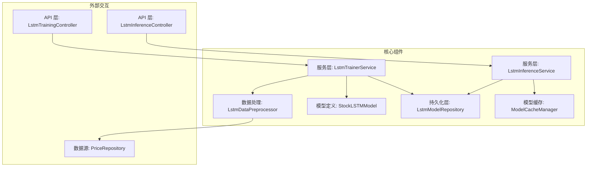

# AI 模型模块设计文档

## 1. 总体架构

AI 模型模块采用分层设计，将数据处理、模型训练、模型服务和持久化等功能解耦，以提高模块的可维护性和扩展性。



### 组件职责

- **Controller (API 层)**: 负责接收外部 HTTP 请求，参数校验，并调用服务层完成具体业务。
  - `LstmTrainingController`: 接收模型训练请求。
  - `LstmInferenceController`: 接收模型推理（预测）请求。
- **Service (服务层)**: 核心业务逻辑层。
  - `LstmTrainerService`: 封装了完整的模型训练流程，包括数据获取、预处理、模型训练、评估和保存。
  - `LstmInferenceService`: 负责加载并管理模型推理。模型以二进制字节数组的形式从 MongoDB 动态加载至内存，全程在内存中操作，不依赖任何本地文件系统。
- **DataPreprocessor (数据处理)**: 负责将原始的股票价格数据转换为模型训练所需的格式（如归一化、序列化）。
- **Model (模型定义)**: `StockLSTMModel` 类定义了 LSTM 网络的具体结构，包括输入层、隐藏层和输出层。
- **Repository (持久化层)**: `LstmModelRepository` 是一个 Spring Data MongoDB 接口，负责与 MongoDB 进行交互，实现模型的增删改查。
#RJ|- **Cache (缓存)**: `ModelCacheManager` 负责缓存加载后的模型实例（以内存中的 `byte[]` 形式存在），避免频繁从 MongoDB 读取。

## 2. LSTM 模型设计

### 2.1. 模型结构 (DJL 实现)

基于 Deep Java Library (DJL) 构建 LSTM 网络。

- **Block (核心结构)**:
  - `SequentialBlock`: 用于顺序堆叠网络层。
  - `LSTM`: DJL 提供的 LSTM 层，设置 `hiddenSize`, `numLayers`, `dropout` 等参数。
  - `Linear`: 全连接层，用于将 LSTM 的输出映射到最终的预测值。
- **输入维度**: `[batchSize, sequenceLength, inputSize]`
  - `sequenceLength`: 时间步长，即使用过去多少天的数据，配置为 `60`。
  - `inputSize`: 输入特征数量。基础为 `5` (OHLCV)，**经过特征工程后会增加**。
- **输出维度**: `[batchSize, 1]`，代表预测的次日收盘价。

### 2.2. 数据预处理与特征工程 (`LstmDataPreprocessor`)

1.  **数据获取**: 从 `PriceRepository` 获取指定股票和时间范围内的原始价格数据。
2.  **特征工程 (P1)**:
    - **计算衍生特征**: 基于获取到的 OHLCV 数据，计算以下技术指标：
        - RSI (相对强弱指数)
        - MACD (平滑异同移动平均线)
        - MA (5日、10日、20日移动平均线)
        - Bollinger Bands (布林带)
        - OBV (能量潮)
    - **拼接特征**: 将计算出的衍生特征与原始 OHLCV 数据合并，形成完整的输入特征集。
3.  **归一化**:
    - 对拼接后的所有特征进行 Min-Max 归一化，将数据缩放到 `[0, 1]` 区间。
    - **公式**: `normalized = (value - min) / (max - min)`
    - `max/min` 等归一化参数必须与模型一同保存，因为在推理时需要用相同的参数对输入数据进行归一化，并对模型的输出进行反归一化。
4.  **序列构建**:
    - 将归一化后的数据按 `sequenceLength` (如 60) 切割成多个输入序列 `X`。
    - 每个序列 `X` 对应的目标值 `y` 是该序列之后一天的收盘价。
5.  **数据集划分**: 将生成的数据集按 `80%` / `20%` 的比例划分为训练集和验证集。

## 3. 模型训练流程 (`LstmTrainerService`)

1.  **初始化**:
    - 创建 DJL `Model` 实例和 `StockLSTMModel` 结构。
    - 配置训练参数：优化器 (Adam)、损失函数 (L2Loss)、监听器等。
2.  **数据准备**: 调用 `LstmDataPreprocessor` 获取并处理数据。
3.  **创建 Trainer**: 基于模型和训练配置创建 `Trainer` 实例。
4.  **迭代训练**:
    - `for epoch in epochs`:
      - 遍历训练数据集 (`trainDataset`)。
      - `trainer.forward()`: 执行前向传播，得到预测值。
      - `loss.evaluate()`: 计算损失。
      - `collector.backward()`: 反向传播，计算梯度。
      - `trainer.step()`: 更新模型权重。
    - **评估**: 每个 epoch 结束后，在验证集 (`valDataset`) 上评估模型，计算 `valLoss`，不更新权重。
5.  **早停判断**:
    - 比较 `valLoss` 与 `bestValLoss`。
    - 如果 `valLoss` 改善，则更新 `bestValLoss` 并保存当前模型快照。
    - 如果连续 `patience` 轮未改善，则触发早停，结束训练。
#WZ|6.  **模型保存**: 训练结束后（或早停触发时），调用 `saveModel` 方法将最佳模型序列化为内存中的字节数组 (`byte[]`) 并保存至 MongoDB。

## 4. 模型持久化设计 (`saveModel` 方法)

### 4.1. 核心逻辑

当 `saveModel` 方法被调用时，传入的 `modelIdentifier` (即股票代码) 是模型的唯一业务标识。

1.  **删除旧模型**:
    - 调用 `lstmModelRepository.deleteByModelName(modelIdentifier)`。
    - Spring Data MongoDB 会执行删除操作，移除 `lstm_models` 集合中匹配的文档。
2.  **序列化新模型**:
    - 将 DJL 在内存中构建的模型（包括权重、结构等）和归一化参数直接序列化为二进制字节数组 (`byte[]`)，并封装为 ZIP 压缩流。全程不产生本地磁盘文件，不进行任何文件系统 I/O。
3.  **保存新模型**:
    - 创建一个新的 `LstmModelDocument` 实例。
    - **`modelName`**: 设置为传入的 `modelIdentifier`。
    - **`params`**: 设置为 ZIP 压缩字节流。
    - **`normalizationParams`**: 保存归一化参数的文本内容。
    - 调用 `lstmModelRepository.save(doc)` 将新模型数据写入 MongoDB。

### 4.2. `LstmModelDocument` 实体

```java
@Document(collection = "lstm_models")
public class LstmModelDocument {
    @Id
    private String id;
    
    // 股票代码，如 "600519"，作为模型的唯一业务标识
    private String modelName; 
    
    // 训练时的 epoch
    private int epoch; 
    
    // 模型参数和其他文件的 ZIP 压缩包
    #QJ|    private byte[] params; // 模型参数和归一化参数的二进制 ZIP 字节数组
    
    // 归一化参数文本
    private String normalizationParams; 
    
    private LocalDateTime createdAt;
}
```

## 5. 推理流程 (`LstmInferenceService`)

1.  **接收请求**: API 传入股票代码。
2.  **加载模型**:
    - 优先从缓存 `ModelCacheManager` 中查找模型。
    #WX|    - 若缓存未命中，调用 `LstmModelRepository.findByModelName(stockCode)` 从 MongoDB 获取模型文档。
    #WX|    - 若缓存未命中，调用 `LstmModelRepository.findByModelName(stockCode)` 从 MongoDB 获取模型文档。模型数据以 `byte[]` 形式读取。
    - 将模型 ZIP 字节数组直接在内存中作为 `InputStream` 解压，并使用 DJL 的 `model.load(InputStream)` 接口加载。全程不写入磁盘。
    - 将加载后的模型存入缓存。
3.  **数据准备**:
    - 获取该股票最新的 `sequenceLength` 条历史数据。
    - 使用模型文档中存储的 `normalizationParams` 对这些数据进行归一化。
4.  **执行预测**:
    - 调用 `predictor.predict()` 方法得到归一化的预测结果。
5.  **反归一化**:
    - 使用 `normalizationParams` 中的 `maxPrice` 和 `minPrice` 对预测结果进行反归一化，得到真实的预测价格。
6.  **返回结果**: 将预测价格返回给调用方。
